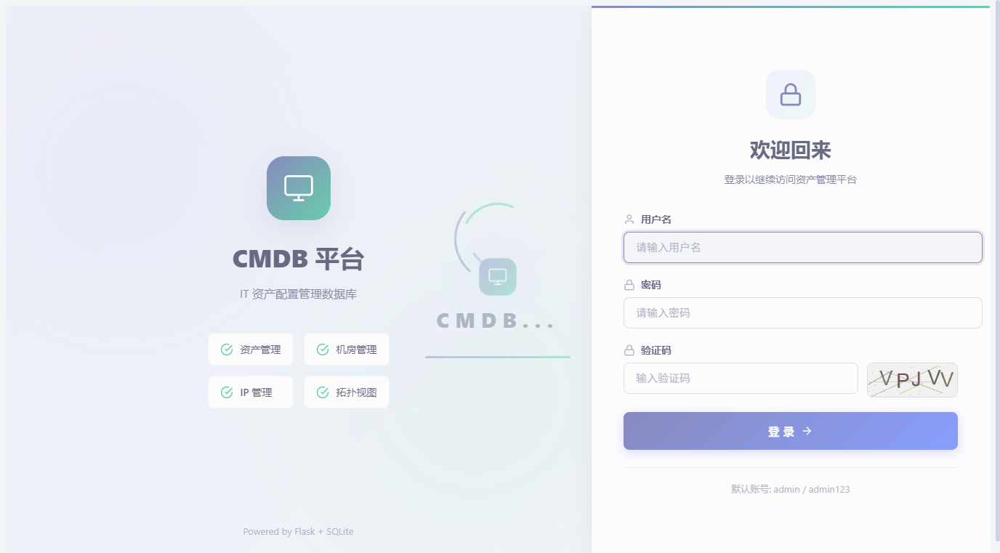
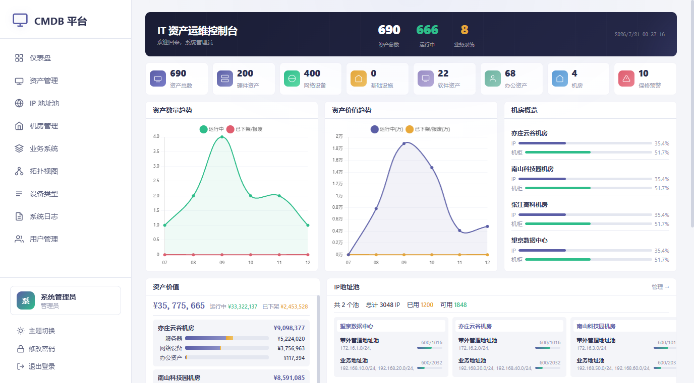
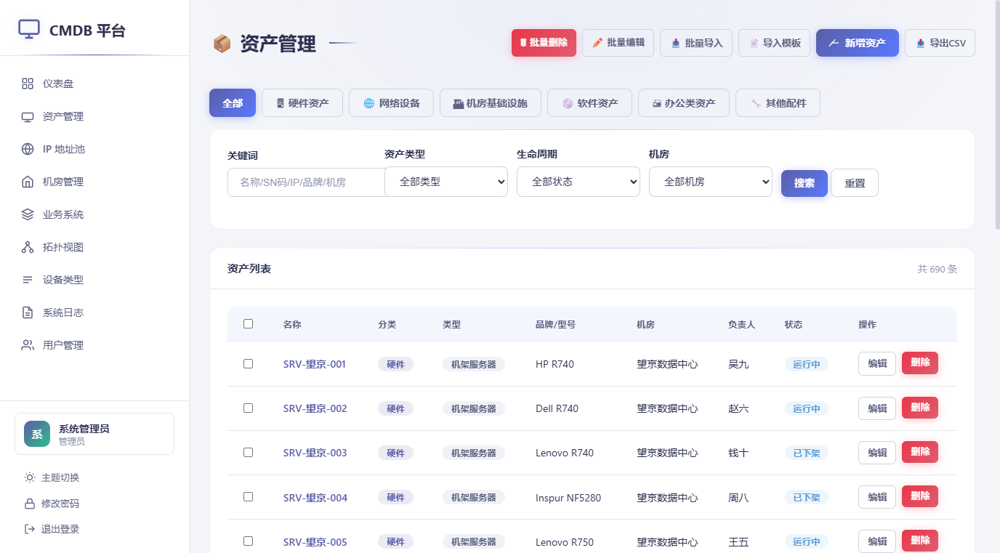
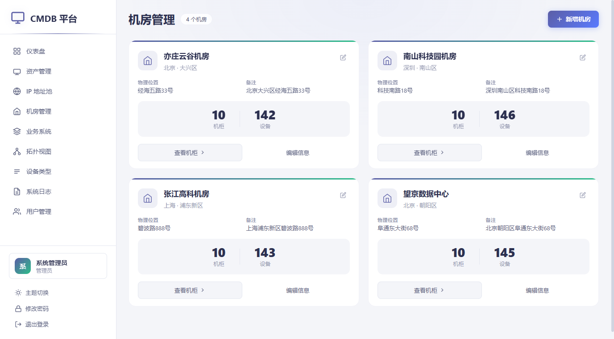
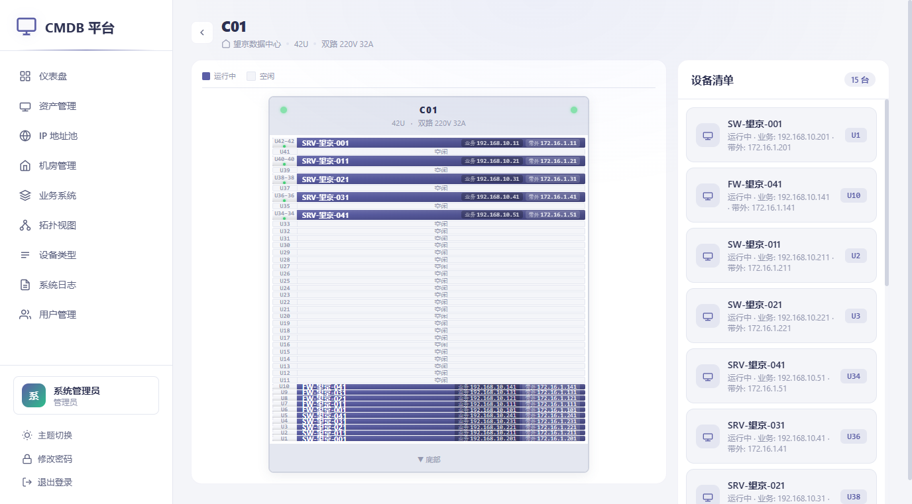
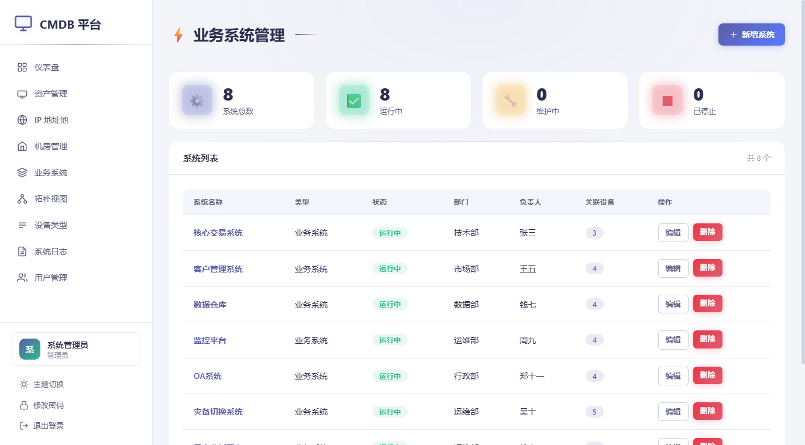
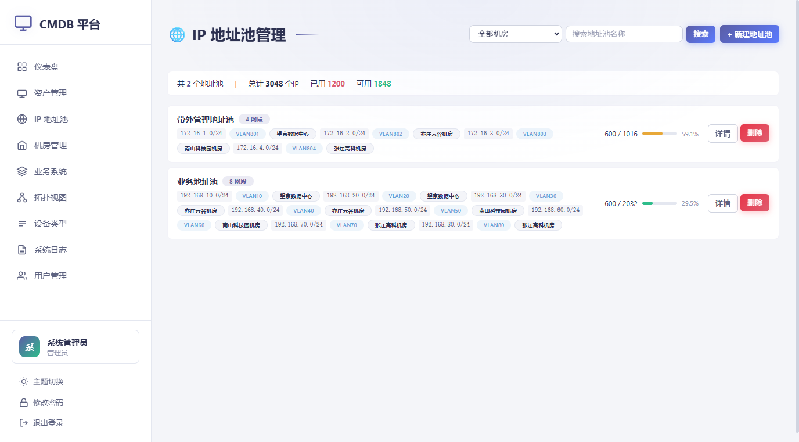
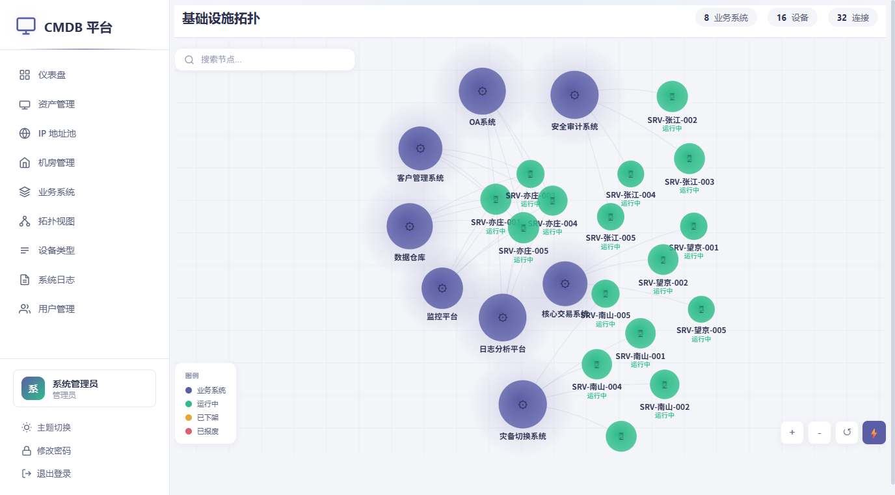

# CMDB 平台 - IT 资产配置管理数据库

轻量化的 IT 资产生命周期管理平台，基于 Python Flask + SQLite 架构，开箱即用。

## ✨ 功能特性

### 📦 资产管理
- 设备增删改查、搜索筛选、分页浏览
- 批量导入/导出 CSV
- 3 种生命周期状态：**运行中**、**已下架**、**已报废**
- 29+ 种设备类型（服务器、网络设备、终端、虚拟化、IoT 等）
- 设备标签管理

### 🏢 机房管理
- 机房/机柜层级管理
- **可视化机柜图**：U 位占用展示，支持 1U/2U/4U 设备合并显示
- 散热间距自动标记
- 设备位置快速定位

### ⚙️ 业务系统
- 业务系统与设备关联管理
- 系统拓扑可视化
- 设备角色标注

### 🌐 IP 地址池
- IP 网段管理
- IP 地址分配/回收
- 自动扫描可用 IP

### 🔐 安全特性
- 用户认证与角色权限（管理员/普通用户/只读）
- 登录验证码（Pillow 生成）
- 登录失败锁定（5 次失败锁定 15 分钟）
- 密码强度策略
- 会话超时控制
- 安全响应头

### 📊 数据统计
- 运维仪表盘
- 设备类型/状态分布图表
- 保修到期预警
- 操作日志审计

---

## 📸 界面预览

### 登录页面


### 仪表盘


### 资产管理


### 机房管理


### 机柜图


### 业务系统


### IP 地址池


### 拓扑视图


---

## 🚀 快速开始

### 方式一：一键启动（推荐）

```bash
# 1. 克隆或下载项目
cd cmdb-platform

# 2. 安装依赖
pip install -r requirements.txt

# 3. 启动服务
python run.py
```

浏览器访问 http://127.0.0.1:5000

**默认管理员账号：** `admin` / `admin123`

### 方式二：直接运行

```bash
pip install -r requirements.txt
python app.py
```

---

## 🖥️ 跨平台部署指南

### Windows

```powershell
# 确保已安装 Python 3.9+
python --version

# 创建虚拟环境（可选但推荐）
python -m venv venv
.\venv\Scripts\activate

# 安装依赖
pip install -r requirements.txt

# 启动
python run.py
```

### Linux / macOS

```bash
# 确保已安装 Python 3.9+
python3 --version

# 创建虚拟环境（可选但推荐）
python3 -m venv venv
source venv/bin/activate

# 安装依赖
pip install -r requirements.txt

# 启动
python3 run.py
```

### Docker 部署

```dockerfile
FROM python:3.11-slim

WORKDIR /app
COPY requirements.txt .
RUN pip install --no-cache-dir -r requirements.txt

COPY . .
EXPOSE 5000

CMD ["python", "run.py"]
```

```bash
# 构建镜像
docker build -t cmdb-platform .

# 运行容器
docker run -d \
  -p 5000:5000 \
  -v cmdb-data:/app/cmdb.db \
  --name cmdb \
  cmdb-platform
```

---

## ⚙️ 配置说明

### 环境变量

| 变量名 | 默认值 | 说明 |
|--------|--------|------|
| `CMDB_HOST` | `0.0.0.0` | 监听地址 |
| `CMDB_PORT` | `5000` | 监听端口 |
| `CMDB_DEBUG` | `true` | 调试模式 |
| `CMDB_SECRET` | 随机生成 | 会话密钥 |

### 配置文件

复制 `.env.example` 为 `.env` 并修改：

```bash
cp .env.example .env
# 编辑 .env 文件
```

---

## 📁 项目结构

```
cmdb-platform/
├── app.py              # 主程序（路由、数据库、业务逻辑）
├── run.py              # 启动脚本
├── requirements.txt    # Python 依赖
├── .env.example        # 环境变量示例
├── .gitignore          # Git 忽略规则
├── README.md           # 项目文档
├── cmdb.db             # SQLite 数据库（自动创建）
├── logs/               # 日志目录（自动创建）
├── static/
│   ├── css/
│   │   └── style.css   # 样式文件
│   └── favicon.svg     # 网站图标
└── templates/          # HTML 模板
    ├── base.html           # 基础布局（侧边栏）
    ├── login.html          # 登录页（含验证码）
    ├── dashboard.html      # 仪表盘
    ├── devices.html        # 设备列表
    ├── device_form.html    # 设备表单
    ├── device_detail.html  # 设备详情
    ├── device_import.html  # 批量导入
    ├── device_types.html   # 设备类型管理
    ├── rooms.html          # 机房列表
    ├── room_form.html      # 机房表单
    ├── room_cabinets.html  # 机柜列表
    ├── cabinet_form.html   # 机柜表单
    ├── cabinet_rack.html   # 机柜图
    ├── systems.html        # 业务系统列表
    ├── system_form.html    # 业务系统表单
    ├── system_detail.html  # 业务系统详情
    ├── topology.html       # 拓扑视图
    ├── ip_pools.html       # IP 地址池列表
    ├── ip_pool_form.html   # IP 地址池表单
    ├── ip_pool_detail.html # IP 地址池详情
    ├── users.html          # 用户列表
    ├── user_form.html      # 用户表单
    ├── change_password.html # 修改密码
    └── logs.html           # 系统日志
```

---

## 📌 使用说明

### 首次使用

1. 启动服务后访问 http://127.0.0.1:5000
2. 使用默认账号登录：`admin` / `admin123`
3. **强烈建议**立即修改默认密码
4. 根据需要添加机房、机柜、设备等资产信息

### 资产状态说明

| 状态 | 说明 | 机柜图显示 |
|------|------|-----------|
| 运行中 | 设备正常运行 | ✅ 显示 |
| 已下架 | 设备已下架 | ❌ 隐藏 |
| 已报废 | 设备已报废 | ❌ 隐藏 |

### 机柜图说明

- 支持 1U、2U、4U 设备高度
- 多 U 设备自动合并显示
- 散热间距自动标记
- 点击设备可跳转详情页

---

## 🔧 生产环境部署

### 使用 Gunicorn（Linux/macOS）

```bash
pip install gunicorn
gunicorn -w 4 -b 0.0.0.0:5000 app:app
```

### 使用 Waitress（Windows）

```bash
pip install waitress
waitress-serve --host=0.0.0.0 --port=5000 app:app
```

### 使用 Nginx 反向代理

```nginx
server {
    listen 80;
    server_name cmdb.example.com;

    location / {
        proxy_pass http://127.0.0.1:5000;
        proxy_set_header Host $host;
        proxy_set_header X-Real-IP $remote_addr;
        proxy_set_header X-Forwarded-For $proxy_add_x_forwarded_for;
        proxy_set_header X-Forwarded-Proto $scheme;
    }
}
```

### Systemd 服务（Linux）

创建 `/etc/systemd/system/cmdb.service`：

```ini
[Unit]
Description=CMDB Platform
After=network.target

[Service]
Type=simple
User=www-data
WorkingDirectory=/opt/cmdb-platform
Environment=CMDB_SECRET=your-production-secret-key
ExecStart=/opt/cmdb-platform/venv/bin/python run.py
Restart=always
RestartSec=5

[Install]
WantedBy=multi-user.target
```

```bash
sudo systemctl daemon-reload
sudo systemctl enable cmdb
sudo systemctl start cmdb
```

---

## 📊 API 接口

| 接口 | 方法 | 说明 |
|------|------|------|
| `/api/stats` | GET | 获取统计数据 |
| `/api/devices/export` | GET | 导出设备 CSV |
| `/api/devices/import` | POST | 导入设备 CSV |
| `/api/devices/template` | GET | 下载导入模板 |
| `/api/devices/batch-delete` | POST | 批量删除设备 |

---

## 🛡️ 安全建议

1. **修改默认密码**：首次登录后立即修改 admin 密码
2. **设置密钥**：在生产环境设置 `CMDB_SECRET` 环境变量
3. **关闭调试**：生产环境设置 `CMDB_DEBUG=false`
4. **使用 HTTPS**：通过 Nginx 配置 SSL 证书
5. **定期备份**：备份 `cmdb.db` 数据库文件
6. **限制访问**：通过防火墙限制访问 IP

---

## 📝 更新日志

### v2.0 (2026-06-25)
- ✨ 简化设备状态为：运行中、已下架、已报废
- ✨ 已下架/已报废设备自动从机柜图、拓扑图、业务系统中剔除
- ✨ 机柜图支持多 U 设备合并显示（1U/2U/4U）
- ✨ 添加跨平台启动脚本 run.py
- ✨ 支持 .env 环境变量配置
- ✨ 添加网站图标
- 📝 完善部署文档

### v1.0
- 🎉 初始版本发布
- ✨ 资产管理、机房管理、业务系统、IP 地址池
- ✨ 机柜图可视化
- ✨ 拓扑视图
- ✨ 用户权限管理

---

## 📄 许可证

MIT License

---

## 🤝 贡献

欢迎提交 Issue 和 Pull Request！
